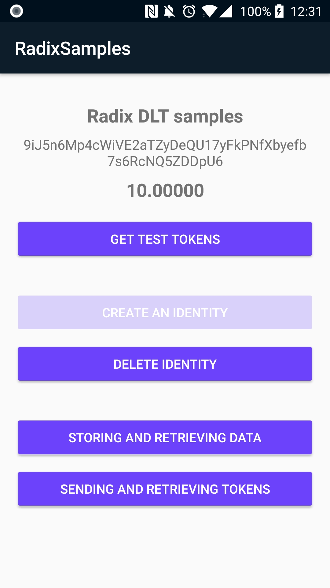
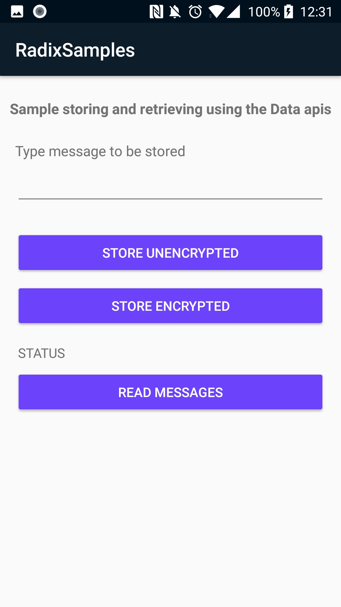
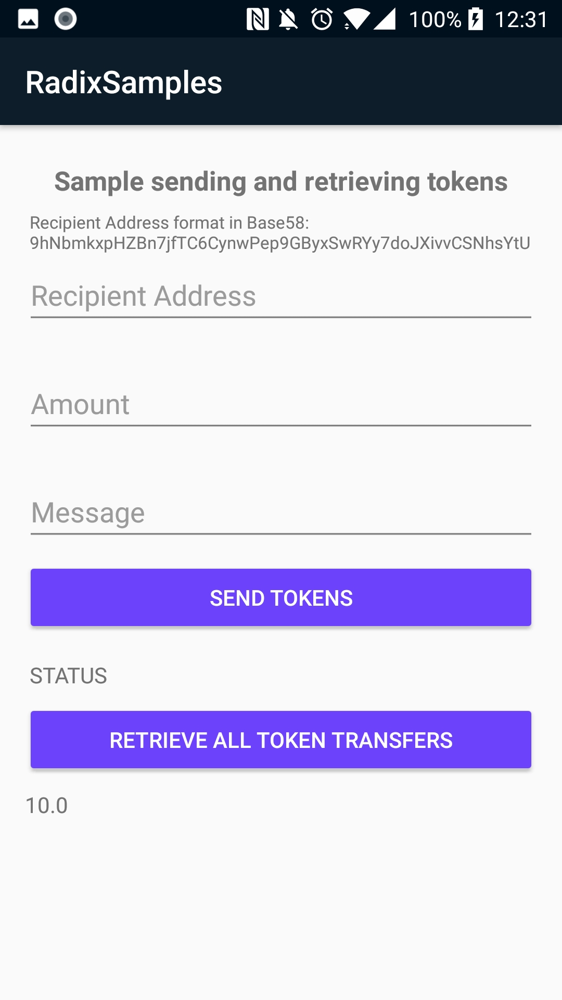

Radix DLT Client Library Samples
==================================

Samples using Radix DLT client libraries (Project is able to use either of the available Java or Kotlin libraries)

[Kotlin Documentation](https://github.com/radixdlt/radixdlt-kotlin/blob/master/README.md)  
[Java Documentation](https://github.com/radixdlt/radixdlt-java/blob/master/README.md)

Screenshots
-----------

